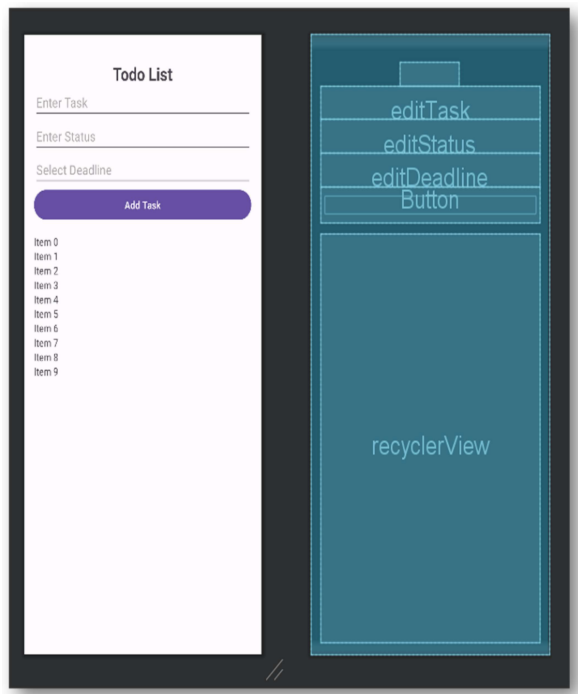
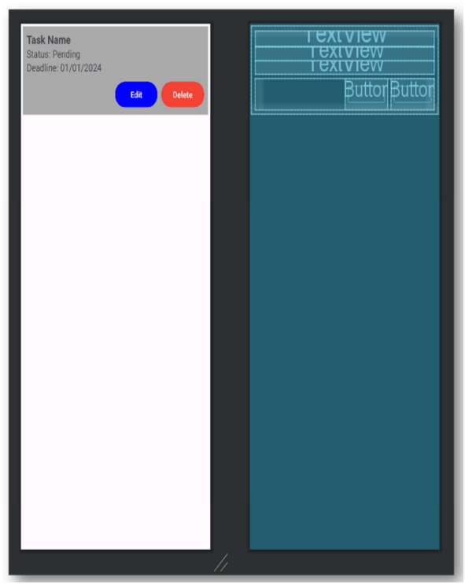
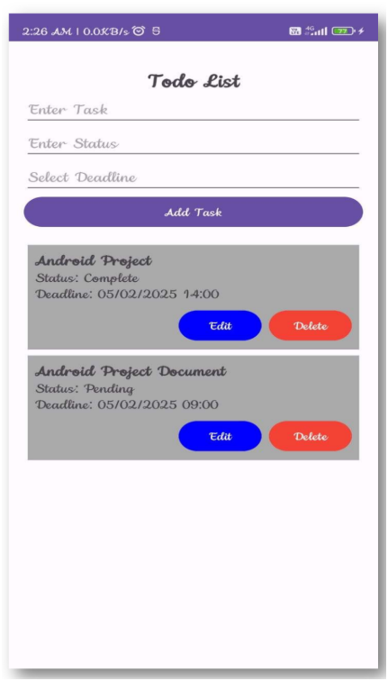
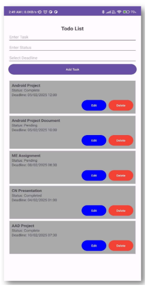

# To-Do List Android Application

A simple and user-friendly To-Do List Android application developed using Kotlin and Android Studio. The application helps users manage daily tasks efficiently by allowing them to add, edit, delete, and organize tasks with deadlines. Data is stored locally using SharedPreferences, enabling the application to work completely offline. The app is built using modern Android development practices, including RecyclerView, Material Design components, and Gson for data serialization. :contentReference[oaicite:0]{index=0}

---

## Features

- Add new tasks
- Edit existing tasks
- Delete tasks
- Set task deadlines using Date & Time Picker
- Track task status (Pending / Completed)
- Offline data storage using SharedPreferences
- Automatic task persistence
- Clean and responsive Material Design interface
- RecyclerView for efficient task management

---

## Tech Stack

- Kotlin
- Android Studio
- XML
- RecyclerView
- SharedPreferences
- Gson
- Material Design Components
- AndroidX Libraries

---

## Project Structure

```
ToDoList/
│
├── app/
│   ├── src/
│   │   ├── main/
│   │   │   ├── java/
│   │   │   │   ├── MainActivity.kt
│   │   │   │   ├── Task.kt
│   │   │   │   └── TaskAdapter.kt
│   │   │   ├── res/
│   │   │   │   ├── layout/
│   │   │   │   ├── values/
│   │   │   │   └── drawable/
│   │   │   └── AndroidManifest.xml
│
├── gradle/
├── build.gradle.kts
├── settings.gradle.kts
└── README.md
```

---

## Requirements

- Android Studio (Latest Stable Version)
- JDK 8 or higher
- Android SDK 24 or above
- Kotlin 1.5 or higher

---
## Screenshots

<table>
  <tr>
    <td align="center">
      <br>
      <b>Home Screen</b>
    </td>
    <td align="center">
      <br>
      <b>Add Task</b>
    </td>
  </tr>
  <tr>
    <td align="center">
      <br>
      <b>Edit Task</b>
    </td>
    <td align="center">
      <br>
      <b>Task List</b>
    </td>
  </tr>
</table>
---

## Installation

Clone the repository:

```bash
git clone  https://github.com/sakshigupta1410/Android-ToDo-App.git
```

Open the project in Android Studio.

Sync Gradle dependencies.

Run the application on an Android Emulator or a physical Android device.

---

## How It Works

1. Enter the task name.
2. Enter the task status.
3. Select a deadline.
4. Click **Add Task**.
5. Edit or delete tasks whenever required.
6. Tasks are automatically saved locally and restored when the application is reopened.

---

## Learning Outcomes

This project demonstrates:

- Android Activity Lifecycle
- RecyclerView Implementation
- SharedPreferences
- Gson Serialization
- Kotlin Data Classes
- Material Design
- DatePickerDialog
- TimePickerDialog
- Local Data Persistence

---

## Future Enhancements

- Room Database Integration
- Firebase Authentication
- Cloud Synchronization
- Push Notifications
- Task Categories
- Priority Levels
- Search and Filter Tasks
- Dark Mode Support

---

## Developer

**Sakshi Gupta**

GitHub: https://github.com/sakshigupta1410
---

## License

This project is licensed under the MIT License.
